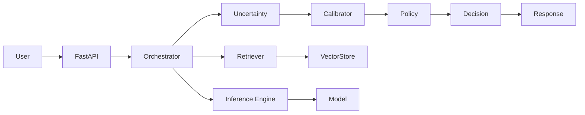

# Codex – Local LLM Inference with Confidence

Codex is a **local inference service** for Large Language Models (LLMs), designed to provide **confidence-aware responses**.  
It supports **uncertainty estimation, calibration, and decision policies** to improve reliability in enterprise and research settings.

---

## 🚀 Features
- **Local Inference Engine**  
  - Supports `vLLM`, `llama.cpp`, or external OpenAI-compatible APIs  
- **Uncertainty Estimation**  
  - Log-probability entropy  
  - Self-consistency variance (multi-sampling)  
  - Evidence overlap (RAG grounding)  
  - Verifier-based scoring  
- **Confidence Calibration**  
  - Temperature scaling  
  - Isotonic regression  
  - Conformal prediction (with coverage guarantees)  
- **Decision Policy**  
  - Answer / Abstain / Defer routing  
- **Traceability & Provenance**  
  - Stores query, evidence, reasoning signals, and final decision  

---

## 📂 Project Structure
```

codex/
configs/                # Model, policy, retriever, calibrator configs
src/
app/                  # FastAPI entrypoints & routers
core/                 # Orchestrator, uncertainty, calibrator, policy
infra/                # Server, storage, logging, queue
evals/                # Datasets, offline eval runners, reports
tests/                  # Unit tests
scripts/                # Build index, warmup, benchmarking
Dockerfile
docker-compose.yml

```

---

## ⚙️ Installation

### Requirements
- Python 3.10+
- Poetry or pip
- GPU (recommended) with CUDA support (for vLLM)

### Setup
```bash
git clone https://github.com/your-org/codex.git
cd codex
poetry install
```

Or with pip:

```bash
pip install -r requirements.txt
```

---

## ▶️ Usage

### Run the API

```bash
uvicorn src.app.main:app --reload --port 8000
```

### Example Inference

```bash
curl -X POST "http://localhost:8000/infer" \
  -H "Content-Type: application/json" \
  -d '{
        "query": "What is the capital of France?",
        "n_samples": 5,
        "enable_rag": true
      }'
```

### Example Response

```json
{
  "answer": "The capital of France is Paris.",
  "confidence": 0.87,
  "decision": "answer",
  "confidence_breakdown": {
    "entropy": 0.12,
    "self_consistency_var": 0.08,
    "evidence_overlap": 0.91,
    "verifier_score": 0.95,
    "calibrated": 0.87
  },
  "trace_id": "abc123",
  "rationale": "Answer supported by retrieved evidence with strong agreement."
}
```

---

## 📊 Evaluation & Calibration

Run offline evaluation with datasets:

```bash
python src/evals/runners/offline_eval.py
```

Generate and update calibrators:

```bash
python src/evals/runners/calibrate.py
```

Metrics include:

* Reliability diagrams
* Expected Calibration Error (ECE)
* Abstention-Accuracy trade-off curves

---

## 🏗 Deployment

### Local

```bash
docker build -t codex .
docker run -p 8000:8000 codex
```

### Docker Compose (with vLLM + Vector Store)

```bash
docker-compose up -d
```

### Kubernetes (optional)

Helm chart under `deploy/k8s` (TBD).

---

## 🧪 Tests

```bash
pytest -v
```

---

## 🤝 Contributing

* Fork & PRs welcome.
* Please add tests for new modules.
* Update `README` and `configs` when adding new confidence methods.

---

## 📜 License

MIT License. See [LICENSE](LICENSE) for details.

---

## 🗺️ Architecture



